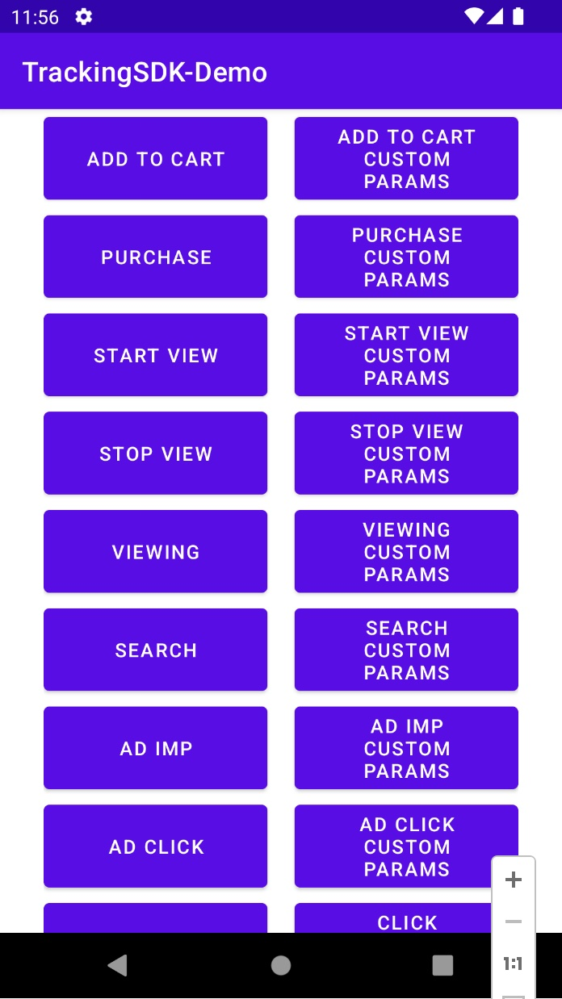
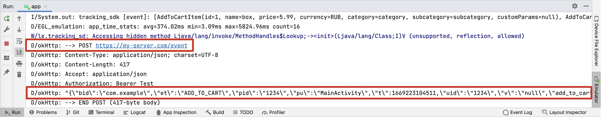

# Tracking Demo app

The Demo app consist of 2 columns with buttons. Each button represents one provided TrackingEvent:

+ 1'st column: buttons to track regular events, such as: `AddToCart` event, `StartView` event, etc.
+ 2'nd column: buttons to track the same event, but with extra `customParams` argument in the call.



## Run application

+ Open the tracking-demo-app in the AndroidStudio.


+ Initialize the Tracking SDK.

  + Open [MainActivity.kt](app/src/main/java/com/example/tracking_sdk/MainActivity.kt) file.

  + Set up the following properties in the `TrackerOptions` shown in the code below:

      ```kotlin
      override fun onCreate(savedInstanceState: Bundle?) {
          super.onCreate(savedInstanceState)
          setContentView(R.layout.activity_main)
        
          val options = TrackerOptions(
              bundle = "com.example",
              partnerId = "1234",
              uid = "1234",
              baseUrl = "https://my-server.com/",
              debugMode = true,
              headers = mapOf("Authorization" to {
                  "Bearer Test"
              })
          )
          val tracker = TechTracker.initialize(options)
    
          . . .
      ```

+ Run the app. Then open `Run` tab in the AndroidStudio.


+ Tap on buttons to see the log output.
There, you can see the JSON request to see what properties sent to backend.  

    


+ Here, couple examples how to track regular event and how to send the event with `customParams`. 
See [MainActivity.kt](app/src/main/java/com/example/tracking_sdk/MainActivity.kt) for more details.
Eg (`Scroll` event):

  ```kotlin
  // REGULAR EVENT
  val event = Scroll(
      value = 1.2,
      category = "category",
      subcategory = "subcategory",
      customParams = mapOf("sample1" to "value1")
  )
  event.page = "MainActivity"
  tracker.event(event)
  
  // THE SAME EVENT (with customParams)
  val event = Scroll(
      value = 1.2,
      category = "category",
      subcategory = "subcategory",
      customParams = mapOf("sample1" to "value1") // <- !!! Here is customParams
  )
  event.page = "MainActivity"
  tracker.event(event)
  ```
