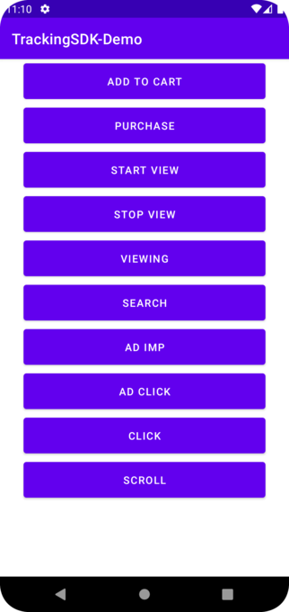

# tracking-demo-app
This Android demo project covers all usages of the library [solutionarchitectstech:android_tracker_sdk_release](https://github.com/solutionarchitectstech/android_tracker_sdk_release)



## 1. Add the dependency to your project
Before usage of the SDK Developer has to add the following dependency to app-module gradle file (the dependency block):
```groovy
dependencies
{
    //... other dependencies
    implementation 'com.github.solutionarchitectstech:android_tracker_sdk_release:0.0.13'
    //... other dependencies
}
```

## 2. initialization of the library
```kotlin
val options = ECOptions(
    bundle = "com.example",
    partnerId = "1234",
    uid = "1234")

val tracker = ECTracker.initialize(options)
```

## 3. track en event
```kotlin
val event = ECAddToCart()
event.page = "MainActivity"
event.add("1", "box", 5.99, "RUB", "category", "subcategory")
event.add("2", "pizza", 399.99, "RUB", "category", "subcategory")
tracker.event(event)
```